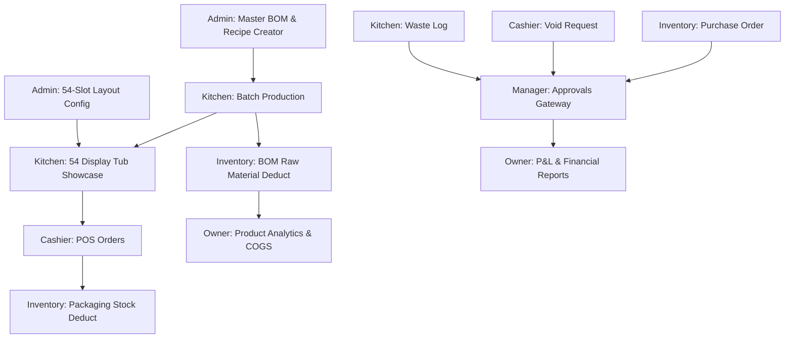

# Design Specification: Gelato ERP System UI/UX & Role Architecture Overhaul

**Date:** 2026-09-02  
**Status:** Approved Draft (Revised per User Feedback)  
**Target System:** Bloc. Gelato ERP System (Next.js + Tailwind CSS + Zustand)

---

## 1. Executive Summary & Design System

System-wide visual overhaul and logical re-architecture of all 6 roles in the Bloc. Gelato ERP application (`cashier`, `kitchen`, `inventory`, `admin`, `manager`, `owner`).

### 1.1 Palette & Aesthetic Guidelines
- **Canvas Background:** `#F8F0E2` (Warm Vanilla Cream) - Soft, warm, artisan aesthetic replacing legacy `#FCF1E1`. Provides optimal contrast for white cards without eye strain.
- **Card Surfaces:** `#FFFFFF` (Pure White) with `1px solid rgba(0, 0, 0, 0.05)` border, `rounded-xl` (12px radius), subtle elevation shadow `0 2px 8px rgba(0,0,0,0.03)`.
- **Sidebar:** `#2D3D6E` (Dark Navy Blue) with soft periwinkle active menu pills (`#7F85D1` background, `#FFFFFF` text).
- **Topbar Header:** Clean frameless layout integrated seamlessly into `#F8F0E2` background, featuring tabular time display (`font-variant-numeric: tabular-nums`), notifications badge, and user profile pill.
- **Category & Series Visual Badges (Skalabel untuk 63+ Rasa):**
  Dikelompokkan berdasarkan **Seri/Kategori Rasa** agar efektif untuk puluhan rasa:
  - `Milk Series`: Soft Periwinkle Blue (`#7F85D1`)
  - `Chocolate Series`: Deep Cocoa Brown (`#7B3F00`)
  - `Fruit & Sorbetto Series`: Vibrant Coral Red (`#E11D48`)
  - `Peanut & Nuts Series`: Warm Amber/Golden (`#D97706`)
  - `Specialty Series`: Soft Gold/Purple (`#8B5CF6`)

---

## 2. Logical Inter-Role Workflows

---

## 3. Detailed Role Architecture & Page Restructuring

### 3.1 Admin Role (`/admin`) — Master BOM & System Config
- `/admin/flavors-catalog`: **Master Formula / Recipe / BOM Creator**. Tempat Admin membuat resep gelato baru, menentukan komposisi bahan baku per tub (Milk 3000g vs Sorbetto 2500g), mengatur tag alergen (Dairy, Gluten, Nuts, Vegan), dan toggle status musiman (Seasonal Event).
- `/admin/showcase-layout`: **54 Display Tub Showcase Mapper**. Pengaturan pemetaan 54 slot display tub (Freezer A: 18 slot, Freezer B: 18 slot, Freezer C: 18 slot).
- `/admin/master-inventory`: Tabbed view master barang (Packaging, Toppings, Raw Materials) dengan update harga yang tersinkronisasi.
- `/admin/vendors-suppliers`: Direktori vendor & supplier bahan baku.
- `/admin/system-config`: Pengaturan PPN 10%, PIN keamanan, dan log audit teknis.
- `/admin/overview`: System health & master status counters.
- *Orphan Cleanup:* Hapus folder kosong (`admin/master-flavors`, `admin/master-items`, `admin/master-suppliers`).

### 3.2 Kitchen Role (`/kitchen`) — Production & 54 Display Tub Showcase
- `/kitchen/overview`: Kitchen KPI summary (batch berjalan, sisa stok tub di 54 slot display, alert tub kedaluwarsa).
- `/kitchen/freezer`: **Visual 54 Display Tub Showcase Grid** (Freezer A 18 tub, Freezer B 18 tub, Freezer C 18 tub). Monitoring level tub, aksi refill tub dari storage, ganti tub habis, dan laporkan waste.
- `/kitchen/production`: Pencatatan batch produksi berdasarkan **BOM Recipe Admin**. Pemilihan resep -> penghitungan otomatis pemakaian bahan baku -> pembuatan Tub ID baru.
- `/kitchen/waste-log`: Pelaporan tub rusak/kedaluwarsa (memerlukan persetujuan PIN Manager).

### 3.3 Cashier Role (`/cashier`) — POS Terminal & Front-of-House
- `/cashier/orders`: POS cashier interface. Tub/Cup size selection, flavor picker dengan **Category Series Color Badges** (skalabel untuk 63+ rasa), topping selector, cart, discount, QRIS/Cash checkout, cetak struk.
- `/cashier/catalog`: Lookup katalog resep & alergen untuk kasir.
- `/cashier/transactions`: Riwayat transaksi, pengajuan void transaksi (butuh persetujuan Manager), cetak ulang struk.

### 3.4 Inventory Role (`/inventory`) — Master Stock & PO
- `/inventory/overview`: Gudang KPI overview (stok bahan kritis dari BOM, pending PO, mutasi).
- `/inventory/stock`: Tabel master stok bahan baku (dari BOM Admin), topping, dan packaging.
- `/inventory/purchase-orders`: Pembuatan PO untuk vendor bahan baku BOM, approval tracking.
- `/inventory/receiving`: Penerimaan barang pesanan dari vendor PO.
- `/inventory/movements`: Log audit mutasi stok real-time (otomatis berkurang saat Kitchen buat batch / Kasir jual packaging).

### 3.5 Manager Role (`/manager`) — Approvals & Store Governance
- `/manager/overview`: Operasional dashboard, shift kasir, hitungan pending approval.
- `/manager/approvals`: Gateway otorisasi 3-in-1 (Approve PO, Approve Void Transaksi, Approve Tub Waste) via PIN Manager.
- `/manager/shift-audit`: Rekonsiliasi kas laci kasir (opening float, cash actual, QRIS/EDC totals, variance report).
- `/manager/staff-management`: Tata kelola akun staf (`csh_*`, `ktc_*`, `inv_*`) terhubung ke `useAuthStore`.
- *Orphan Cleanup:* Hapus folder kosong (`manager/shift-reconciliation`, `manager/staff-accounts`).

### 3.6 Owner Role (`/owner`) — Executive Analytics & P&L
- `/owner/overview`: Executive KPI (Revenue, Net Profit, COGS ratio dari BOM, Waste cost).
- `/owner/financial-reports`: P&L statement table (Revenue, COGS, OPEX, Net Profit) + tombol ekspor PDF & Excel.
- `/owner/product-analytics`: Top 5 Best Sellers chart, margin profit per seri rasa.
- `/owner/manager-accounts`: Tata kelola akun Manager (`mgr_*`) terhubung ke `useAuthStore`.
- *Orphan Cleanup:* Hapus folder kosong (`owner/executive-summary`).

---

## 4. Reusable UI Components to Build/Upgrade

1. `DataTable.tsx`: Tabel data universal dengan search bar, filter tabs, sorting, pagination, dan empty state.
2. `CategoryBadge.tsx`: Tag visual kategori/seri rasa gelato (Milk, Chocolate, Fruit, Peanut/Nut, Specialty) yang skalabel untuk 63+ rasa.
3. `KpiCard.tsx`: Kartu indikator KPI dengan statistik tren (`+8.5%`) dan indikator status warna.
4. `FramelessHeader.tsx`: Modern topbar header dengan jam desimal tabular (`font-variant-numeric: tabular-nums`), dropdown notifikasi, dan avatar user.
5. `ApprovalPinModal.tsx`: Dialog verifikasi PIN Manager untuk otorisasi aksi kritis.

---

## 5. Verification Plan

- Build check: `npm run build` untuk memastikan nol error TypeScript dan nol broken imports.
- Workflow check: Verifikasi alur BOM Admin -> Produksi Kitchen -> Pemotongan Stok Inventory -> Penjualan POS Kasir -> Laporan P&L Owner.
- Showcase check: Pastikan visualisasi 54 slot display tub (Freezer A, B, C) berjalan presisi.
